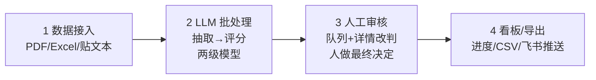

# Agent 工程化手册

> 面向业务专家的自助开发指南：照着本手册 + 本目录的代码骨架，就能做出第二个、第三个 Agent 系统。
>
> 本模板的出处：第一个跑通的系统 `apps/resume-screening/`（简历初筛 Agent）已验证了全部模式，本目录是它的泛化副本。遇到不确定的地方，去看 resume-screening 对应的文件怎么写。
>
> 前置：会用 Claude Code / Codex 这类 agentic coding 工具。本手册里"让 AI 改代码"是默认动作。

---

## 目录

1. [四段式架构：所有系统的共同骨架](#1-四段式架构)
2. [五步做出一个新系统](#2-五步做出一个新系统)
3. [LLM provider 切换与模型分层](#3-llm-provider-切换与模型分层)
4. [17 个可复用系统定制索引](#4-17-个可复用系统定制索引)
5. [三条业务红线（不可违反）](#5-三条业务红线)
6. [技术底座速查](#6-技术底座速查)

---

## 1. 四段式架构

我们验证过的 14 个业务系统都是同一个骨架（详见 `docs/patterns.md` 的模式说明）：



| 段 | 职责 | 模板代码 | 可替换点 |
|---|---|---|---|
| 1 数据接入 | 把业务数据变成 pending 记录 + 纯文本 | `src/lib/pdf.ts`（解析）、上传 API 模式 | 解析器类型（PDF/Excel/文本）、上传表单字段 |
| 2 LLM 批处理 | 并发跑"抽取→评分"，落库 + token 统计 | `src/llm/`（provider/client/schemas）、`src/lib/process.ts` | **两个 prompt + 两个 zod schema（唯一必须手写的业务知识）** |
| 3 人工审核 | 浏览 AI 建议，人改判定案 | `src/components/ReviewTable.tsx`、`ReviewDrawer.tsx` | 表格列配置、档位文案、详情展示字段 |
| 4 看板/导出 | 进度跟踪、结果离开系统 | `src/lib/csv.ts`、批次轮询模式 | CSV 列、飞书 webhook、业务状态机扩展 |

**四段之间的关系**：1、2 段是"AI 干活"，3 段是"人把关"，4 段是"结果进流程"。AI 提建议、人做决定——这个分工是设计出来的，不是妥协：全自动意味着错一次就失去业务方信任，人工审核把信任成本降到最低，同时把 AI 的产出变成"越看越有数据"的资产（human_verdict 与 ai_verdict 的差异就是 prompt 调优的方向）。

---

## 2. 五步做出一个新系统

以"达人自动筛选建联"为例（对照：简历初筛的做法写在每一步后面）。

### 第 1 步：复制模板（10 分钟）

```bash
cp -r template apps/<新系统名>     # 如 apps/influencer-screening
cd apps/<新系统名>
```

然后从 `apps/resume-screening/` 复制工程外壳并按需改 `name`：

```bash
cp apps/resume-screening/{package.json,tsconfig.json,next.config.ts,tailwind.config.ts,postcss.config.mjs,.env.example,.gitignore} apps/<新系统名>/
cd apps/<新系统名> && npm install
```

> 对照：简历初筛的 package.json 依赖就是全集——next 15 / better-sqlite3 / @anthropic-ai/sdk / pdf-parse / zod / p-limit / vitest。Excel 场景加 `xlsx` 包。

### 第 2 步：定义 schema（30 分钟）

改 `src/db/schema.sql`：

- `batches.context_text` 改名为你的批次上下文字段（达人筛选：合作 brief；简历初筛：JD 全文 `jd_text`）。
- `items` 表加 1–3 个业务冗余列，只加列表页高频展示的（达人筛选：昵称、粉丝数；简历初筛：姓名 `name`、年限 `years_experience`）。
- **不动**：status 五值状态机、extract_json/score_json、ai_*/human_* 字段组。这是审核 UI 的数据契约。

```bash
npm run db:migrate   # 或启动应用后任一 API 自动迁移（幂等）
```

### 第 3 步：写领域 prompt（1–2 小时，核心工作）

参考 `src/llm/domain.example.ts`，新建 `src/llm/domain.ts`，写四个东西：

1. **ExtractSchema（zod）**：从原始文本抽什么字段。
2. **EXTRACT_SYSTEM（prompt）**：角色 + 输出形状 + `output ONLY a JSON object`（这句必须有）。
3. **ScoreSchema（zod）**：三档 verdict + score 0-100 + reason ≤300 字 + risks[]。
4. **SCORE_SYSTEM（prompt）**：评分 rubric——什么算 recommend、什么算 reject，写得越具体，AI 越稳。

> 对照：简历初筛的 prompt 见 `apps/resume-screening/src/llm/client.ts` 的 EXTRACT_SYSTEM/SCORE_SYSTEM；评分标准（"recruiter 视角、给理由和风险点"）是让人工审核敢确认的关键。
>
> Excel 数据源（如达人名单）跳过抽取 prompt——数据已结构化，LLM 只做评分/生成。

### 第 4 步：配置队列列（30 分钟）

在审核页用 `ReviewTable` 传 `columns` 配置：

```tsx
<ReviewTable
  rows={items}
  columns={[
    { key: 'nickname', title: '昵称' },
    { key: 'followers', title: '粉丝数', align: 'right' },
    { key: 'ai_score', title: 'AI 分', align: 'right' },
    { key: 'reason', title: '理由', render: (r) => <span title={r.reason}>{r.reason}</span> },
  ]}
  verdictLabels={{
    recommend: { label: '优先建联', className: 'bg-green-100 text-green-800' },
    hold:      { label: '备选',     className: 'bg-yellow-100 text-yellow-800' },
    reject:    { label: 'pass',    className: 'bg-red-100 text-red-800' },
  }}
  onSelect={(id) => setSelected(id)}
/>
<ReviewDrawer itemId={selected} apiBase="/api/items" verdictOptions={[...]} ... />
```

档位文案随业务改（推荐/待定/拒绝 → 优先建联/备选/pass），保持三档结构。

### 第 5 步：接数据源（1 小时 – 半天）

三选一（成本升序）：

| 形态 | 做法 | 模板支撑 |
|---|---|---|
| 贴文本 | textarea → POST 建 batch + 单 item | 首页表单模式（见 resume-screening `app/page.tsx`） |
| Excel 导入 | `xlsx` 解析，每行 INSERT 一个 item | `lib/pdf.ts` 同目录加 `excel.ts` |
| 文件上传 | multipart → 存 uploads/ → parse | POST route 模式 + `lib/pdf.ts` |

跑通验收标准：建一个批次 → 处理完成（done/total 满）→ 审核队列能过滤/搜索/改判 → 导出 CSV 中文不乱码。用依赖注入 mock 掉 LLM（`process.ts` 的 hooks 参数）可以先无 key 冒烟全链路。

---

## 3. LLM provider 切换与模型分层

### Provider 切换

环境变量控制，代码零改动（`src/llm/providers.ts`）：

```bash
# 默认：火山引擎 Ark（Coding Plan 端点，成本最低）
LLM_PROVIDER=ark
VOLCENGINE_API_KEYwinomp=...        # 或 ARK_API_KEY
# ARK_BASE_URL 默认 https://ark.cn-beijing.volces.com/api/coding/v1
# 注意：必须用 /api/coding/v1 端点，/api/v3 走普通计费，贵。

# 备选：Anthropic
LLM_PROVIDER=anthropic
ANTHROPIC_API_KEY=sk-ant-...
```

新增 provider（如内部网关）：实现 `LlmProvider` 接口（一个 `chat()` 方法），在 `getProvider()` 加一个分支。

### 模型分层原则

**强模型做判断，弱模型做苦力。** 两次调用分开配模型：

| 调用 | 环境变量 | 默认（Ark / Anthropic） | 选型逻辑 |
|---|---|---|---|
| 抽取 extract | `EXTRACT_MODEL` | ark-code-latest / claude-sonnet-4-5 | 结构化抽取是模式匹配，弱模型足够，量大要省钱 |
| 评分 score | `SCORE_MODEL` | ark-code-latest / claude-opus-4-5 | 理由和风险点直接决定人敢不敢确认 AI，用最强 |

实操建议：

1. **开发期全用最便宜的**跑通链路，再用真数据评哪级需要升级。
2. 升级顺序永远是先升 score 模型。抽取错一两个字段，审核时人一眼能看到；评分理由写得烂，整个系统失去信任。
3. 成本看板数据现成：`batches.input_tokens/output_tokens` 每批次累加，周报直接引用。
4. 同一 provider 内大小模型价差通常 3–5 倍；一批 50 条记录，抽取用弱模型省下的钱够评分用强模型烧还有富余。

---

## 4. 17 个可复用系统定制索引

全清单与工程量评估见 `docs/analysis/2026-09-16-vibecoding-catalog-and-acceleration.md`。下表标注每个系统**四段式中哪几段需要定制**（①接入 ②批处理 ③审核 ④看板导出），未标注的段直接用模板默认：

| # | 系统 | 定制段 | 定制要点 |
|---|---|---|---|
| 1 | 简历初筛 Agent ✅已交付 | — | 参考实例 `apps/resume-screening/`，模板从它泛化 |
| 2 | 候选人 outreach 话术 | ②④ | ②单轮生成替代抽取+评分（跳过 ExtractSchema）；④输出话术到 drawer 供复制，**外发必须人工点头（红线一）** |
| 3 | 面试题+面试纪要分析 | ② | ②SCORE_SYSTEM 换成岗位能力 rubric（每岗位一套锚点评分表）；verdict 只做参考，**不自动淘汰（红线二）** |
| 4 | 沉睡人才库激活 | ①② | ①数据源是历史简历库（跑批匹配而非上传）；②评分方向反转（JD→人 改 人→新 JD），话术生成同 #2 |
| 5 | 入职引导 Bot | ①②④ | ①接入内部文档建 RAG（新增向量检索，四段式唯一结构性扩展）；②LLM 改问答式；④checklist 是个普通 CRUD 页 |
| 6 | 达人自动筛选建联 | ①②④ | ①蝉妈妈/飞瓜/星图导出 Excel 导入（**用导出数据不抓取，红线三**）；④加"建联→已读→寄样→挂车"状态机 tab；话术外发人工点头（红线一） |
| 7 | 产品客服培训系统 | ①②④ | ①内部文档 RAG（与 #5 同构，先做这个热身）；②新增角色扮演演练 prompt；④测验成绩单看板 |
| 8 | 竞品情报监控 | ①④ | ①定时任务多源抓取（维护税最高，优先用平台订阅/导出）；③审核降为"日报人工确认"；④飞书日报推送 |
| 9 | 用户之声 VoC 分析 | ②④ | ②两级调用改"情感打标+主题聚类"（嵌入模型批量跑）；④问题榜/卖点共鸣榜看板，人工校验归因闭环 |
| 10 | GTM 内容工厂 | ②③④ | ②生成+爆款库风格 RAG；③审核加重——**每条出站内容必须人工点发（红线一）**；④多渠道素材库 |
| 11 | 达人寄样履约跟踪 | ①④ | ①快递 100 API 轮询 + 抖音发布检测；②几乎无 LLM（轻 AI 重流程）；④状态机+到期自动催办（内部提醒） |
| 12 | 营销素材智能库 | ①② | ①多模态模型批量打标入库；②语义检索替代评分（向量索引）；审核弱化 |
| 13 | 会议→行动项→自动看板 | ②④ | ②抽取行动项/决策（模板 domain.example.ts 就是这个例子）；④看板状态回写+下次开会自动对账 |
| 14 | IPD 阶段门评审助手 | ①② | ①评审材料多格式解析（BOM/测试报告）；②checklist 核查 prompt + 历史坑 RAG；人工主导最重 |
| 15 | 研发周报自动生成 | ①④ | ①飞书项目/多维表格 API 拉数；②汇总生成单轮调用；③PM 确认发出；④定时生成 |
| 16 | 缺陷/客诉智能分诊 | ②④ | ②分类 prompt + 相似 bug 向量检索；④指派建议看板+错误分诊兜底路由 |
| 17 | 项目风险雷达 | ②④ | ②每条风险信号一个检测器 prompt；④管理层看板；误报率靠 human_verdict 反馈迭代压低 |

复用顺序建议（与清单文档一致）：简历初筛 → 人才库激活/面试分析 → 客服培训 → 入职 Bot → 达人筛选 → 寄样跟踪/素材库 → 会议看板 → 周报/风险雷达。

---

## 5. 三条业务红线

**任何系统、任何迭代、任何人提议"自动化掉"时，先对照这三条。**

1. **外发内容必须人工点头。** 建联话术、候选人沟通、GTM 出站文案——AI 生成、人审、人点发送。系统里永远没有"自动发送给外部"的按钮。技术实现：外发动作只能由 human_verdict 通过后的手动操作触发，API 不提供批量自动外发端点。
2. **招聘不自动拒人。** AI 评分只是排序参考，"拒绝"档位不产生任何自动动作（不发拒信、不移出人才库）。AI 可以建议，只有 HR 的 human_verdict 能定案。
3. **抓取类功能优先用导出数据。** 蝉妈妈/飞瓜/星图/电商后台都有官方导出；用导出 Excel 接入，不逆向抓取（封号风险 + 平台 ToS + 维护税）。确需抓取的（竞品监控），先确认频率、账号隔离和法务边界再动手。

---

## 6. 技术底座速查

- **技术栈**：Next.js 15（App Router）· TypeScript · Tailwind · better-sqlite3（WAL，单文件，免运维）· zod · Vitest。
- **本目录代码**：`src/db`（单例+迁移）· `src/llm`（provider/重试/JSON 解析/模型分层）· `src/lib`（pdf/csv/批处理 pipeline）· `src/components`（ReviewTable/ReviewDrawer）· `src/llm/domain.example.ts`（领域层写法示例，会议行动项）。每个文件头部注释写明"从哪泛化、保留什么、哪里必须改"。
- **模式细节**：`docs/patterns.md`（每段职责/可替换点/坑/段间契约）。
- **参考实例**：`apps/resume-screening/`（可跑、有 22 个单测 + 无 key 冒烟脚本）。
- **模板定位**：供复制的骨架，语法已验证（tsc 通过）；复制进 Next.js 工程外壳后即可运行，不独立安装。
- **目录约定**：monorepo 下 `apps/<系统名>/` 一系统一目录，共享的只有本模板与文档，不做跨系统代码依赖——复制优于复用，各系统独立演化。

---

*版本：2026-09-16 · 基于 resume-screening 首个生产验证实例抽取*
