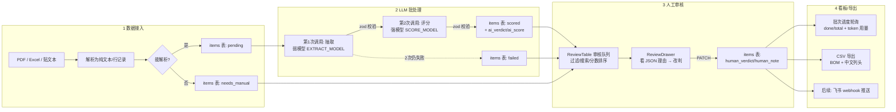

# 四段式模式说明

本文是《Agent 工程化手册》（template/README.md）的技术配套：把四段式每一段的**职责、可替换点、已验证的坑**写清楚。手册回答"怎么做"，本文回答"为什么这样做、改哪里会断"。

参考实例：`apps/resume-screening/`（简历初筛 Agent，第一个跑通全链路的系统）。

---

## 全景：四段式数据流

关键不变量（改动会破坏 UI/统计，必须保持）：

1. **批次/条目两层结构**（batches / items）：批次管进度与成本，条目管状态机与裁决。
2. **条目状态机五值**：`pending → extracted → scored`，旁路 `needs_manual`（解析失败）、`failed`（LLM 两次重试仍败）。审核队列的"需人工/失败"过滤按钮直接读这两个值。
3. **AI 建议与人工裁决分离**：`ai_*` 字段由 pipeline 写，`human_*` 字段只能由 PATCH 人工写入，永远不被覆盖。这是"人做最终决定"的技术实现。
4. **JSON 原文留档**：`extract_json`/`score_json` 存 LLM 输出的完整 JSON，冗余字段（ai_score 等）只是列表页的展示缓存。出问题时能回溯模型到底说了什么。

---

## 第 1 段：数据接入

**职责**：把业务方能提供的东西（文件上传、Excel 导出、粘贴文本）变成 items 表里的 pending 记录 + 可解析的文本。

**三种形态，按成本升序**：

| 形态 | 适用 | 实现要点 |
|---|---|---|
| 贴文本/表单 | 周报、会议纪要、JD | 一个 textarea，直接 INSERT |
| Excel 导入 | 达人名单、评价导出、任务清单 | `xlsx` 包 `sheet_to_json`，每行一个 item；**Excel 已结构化，跳过 LLM 抽取，直接进评分** |
| 文件上传（PDF） | 简历、说明书、评审材料 | multipart 接收 → 存 `uploads/<batch_id>/` → `lib/pdf.ts` 解析 |

**可替换点**：解析器（PDF/Excel/文本各一个函数）、上传 UI。

**已验证的坑**：
- 扫描件 PDF 解析出来是空串——**不要报错**，标记 `needs_manual` 走人工通道（resume-screening 的 `scanned_empty.pdf` 就是这条路径的测试夹具）。
- 文件名取 `path.basename()` 再落盘，防路径穿越。
- Excel 导出数据优先于抓取（三条红线之三），接入段设计先问业务方"你能从平台导出什么"。

---

## 第 2 段：LLM 批处理

**职责**：并发地（p-limit = 5）对每条 pending 记录跑"抽取 → 评分"两级调用，结果落库，token 用量累加到批次。

**两级调用的分工（模型分层）**：

| 级 | 模型档 | 干什么 | 为什么 |
|---|---|---|---|
| 抽取 extract | 弱/便宜（EXTRACT_MODEL） | 非结构化文本 → 结构化 JSON | 苦力活，错一两个字段人工审核能兜 |
| 评分 score | 强/贵（SCORE_MODEL） | 结合批次上下文给 verdict/score/reason/risks | 直接决定审核者的信任度，理由质量不能省 |

**四个必须保留的机制**（都在 `src/llm/client.ts` + `src/lib/process.ts`）：
1. **重试一次**：瞬时 429/5xx 多，第二次还失败说明是数据/prompt 问题，落 failed。
2. **鲁棒 JSON 解析**：剥 markdown fence → 截取首个 `{` 到末个 `}` → zod 校验。prompt 里必须写 `output ONLY a JSON object`。
3. **zod 契约**：模型少字段/类型错在校验处抛错，不让脏数据进库。
4. **token 累加**：每条处理完 `UPDATE batches SET input_tokens = input_tokens + ? ...`——这是给老板看成本的数据源。

**可替换点**：两个 system prompt + 两个 zod schema（即 `llm/domain.example.ts` 演示的 domain.ts）。**这是整个模板中唯一必须手写业务知识的地方。**

**测试模式**：`process.ts` 的 hooks 依赖注入——smoke 测试传 mock 的 extract/score，真实 PDF 解析 + 假 LLM，不需要 API key 就能验证全链路。

---

## 第 3 段：人工审核

**职责**：人快速浏览 AI 的建议，做出最终裁决。AI 是提建议的实习生，人是签字的主管。

**界面三件套**（`src/components/`）：
- `ReviewTable`：档位过滤按钮组（带计数）+ 搜索 + 表格。已评分按分数降序，needs_manual/failed 沉底——**让审核者先看最可能通过的和必须人工的，中间地带后看**。
- `ReviewDrawer`：AI 与人工档位并排 + extract/score 全量 JSON 展示 + 改判下拉 + 备注。
- 保存走 `PATCH /api/items/<id>`，只写 human_* 字段。

**设计理由**：
- **JSON 全量展示不是偷懒，是可解释性**：审核者敢点"确认"的前提是能看到模型的完整理由和风险点。后续可以美化渲染，但留档 JSON 的 section 别删。
- **改判选项第一个永远是"（未改判）"**：不强制每条都人工表态，AI 建议默认成立，人只处理不同意的。这把审核工作量从"每条都点"降到"只点异议"。
- 三档 verdict 结构（recommend/hold/reject 或业务等价物）是过滤/徽章/排序/UI 的共同契约，改文案可以，别改档数。

---

## 第 4 段：看板/导出

**职责**：让结果离开系统，进入业务流程。

**模板自带的两个出口**：
1. **批次进度看板**：前端 2s 轮询 `GET /api/batches/<id>` 拿 done/total/status/token，处理完自动跳审核队列。
2. **CSV 导出**（`src/lib/csv.ts` + export route）：`\uFEFF` BOM（否则 Excel 打开中文乱码）+ CRLF 行尾 + 中文列头。列 = 冗余字段 + 从 JSON 摊平的展示字段。

**可替换/新增点**：
- 飞书 webhook 推送（竞品监控日报、风险雷达提醒）：批次 done 时在 process route 的 `.then()` 里发消息。
- 多阶段状态机（寄样跟踪的"建联→已读→寄样→挂车"）：给 items 加业务状态列，审核队列按状态列分 tab。
- 自动催办：定时任务扫"超期未推进"的 items，调飞书机器人。**注意：催办通知是系统内提醒，不是对外沟通，不触发红线一。**

---

## 段间契约速查

| 契约 | 生产者 → 消费者 | 破坏后果 |
|---|---|---|
| `batches.context_text` | 接入段 UI → score prompt | 评分没有对照物 |
| `items.status` 五值状态机 | pipeline → 审核队列过滤 | "需人工/失败"按钮失效 |
| `ai_verdict/ai_score` 冗余字段 | pipeline → 列表排序/徽章 | 列表要逐行解析 JSON，N+1 |
| `extract_json/score_json` 原文 | LLM → drawer 展示/回溯 | 无法解释 AI 为什么这么判 |
| `human_*` 只 PATCH 写 | 审核 UI → 导出/报表 | 红线失守：AI 自动做了最终决定 |
| token 累加 SQL | pipeline → 批次成本 | 无法向老板报 ROI |
